# Audio Processing Architecture

Comprehensive reference for how Voice Control processes audio: the component
layout, the end-to-end pipeline, every DSP stage, and — the focus — **how
processing decisions are made** (which EQ moves, how much noise reduction, how
loud). Diagrams lead; prose explains.

The DSP is platform-agnostic and lives in [`core/`](../core) (namespace `vc`).
The JUCE desktop app in [`desktop-juce/`](../desktop-juce) is glue: it owns
decoded audio, drives FFmpeg, builds parameters from the UI, and calls into
`vc_core`. The core never depends on JUCE; the UI never reimplements DSP.

---

## 1. System overview

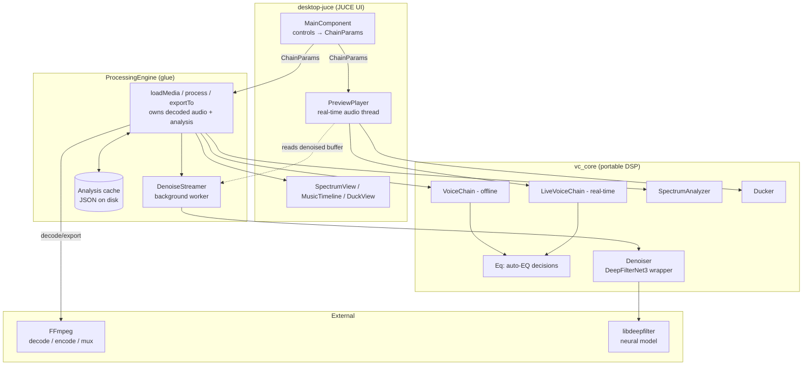

Two things to hold onto from the start:

- **There are two chains.** `VoiceChain` is the offline/authoritative renderer
  (used by `process()` and export). `LiveVoiceChain` is the real-time preview on
  the audio thread. Same stage order; small deliberate differences (§7).
- **Noise reduction is not a chain stage.** The denoised signal is produced
  out-of-band by the neural model, cached, and blended with the dry original
  *before* either chain runs (§3, §5).

---

## 2. End-to-end pipeline

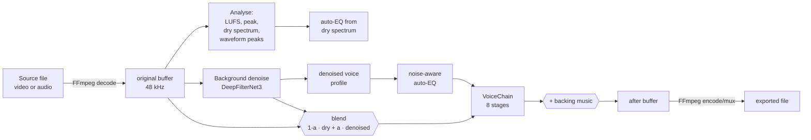

The whole result is, conceptually:

```
result = VoiceChain( blend(original, denoised, amount) ) + music
```

| Phase | Where | Cost | Notes |
|---|---|---|---|
| Decode | `loadMedia` → FFmpeg | slow | always to 48 kHz WAV via temp file |
| Analyse | `loadMedia` | medium | LUFS, peak, dry spectrum, peaks; cached |
| Denoise | `DenoiseStreamer` | background | faster-than-real-time, playhead-first |
| Profile swap | `refreshVoiceProfileFromDenoised` | medium | re-measures spectrum from denoised |
| Render | `process` / `LiveVoiceChain` | fast | blend → chain → music |
| Export | `exportTo` | slow | waits for full denoise, then FFmpeg |

---

## 3. The signal chain (`vc::VoiceChain`)

```mermaid
flowchart LR
    IN["blended input"] --> PG["0 · pre-gain<br/>calib + intensity"]
    PG --> HP["1 · high-pass<br/>rumble"]
    HP --> EQ["2 · EQ<br/>auto-EQ + tone"]
    EQ --> FC["3 · fast comp<br/>peak control"]
    FC --> GC["4 · glue comp<br/>density"]
    GC --> DE["5 · de-esser<br/>sibilance"]
    DE --> LN["6 · loudness<br/>→ target LUFS"]
    LN --> LM["7 · limiter<br/>ceiling"]
    LM --> OUT["output"]

    classDef adaptive fill:#2d5,stroke:#093,color:#000
    classDef fixed fill:#ddd,stroke:#999,color:#000
    class EQ adaptive
    class PG,HP,FC,GC,DE,LN,LM fixed
```

Defined in [`core/VoiceChain.cpp`](../core/VoiceChain.cpp). Fixed stage order,
processed in place. **EQ is the only content-adaptive stage** (green); every
other stage uses fixed numeric parameters chosen by preset + intensity. Each
stage reads its own fields from one `ChainParams` struct
([`core/Presets.h`](../core/Presets.h)) — adding a stage means adding fields, not
changing the chain interface.

The blend step (`blendNoiseReduction`) runs in
[`ProcessingEngine.cpp`](../desktop-juce/ProcessingEngine.cpp) *before* the chain;
music is mixed in *after* (offline) or summed live (preview).

### Stage details

| # | Stage | Class | Key behavior |
|---|---|---|---|
| 0 | pre-gain | inline | `inputCalibrationGainDb + intensityDriveDb`, linear |
| 1 | high-pass | `Biquad` | per channel, `highpassHz` (70–110), Q 0.707 |
| 2 | EQ | `EqSection` | auto-EQ bands + tone bands (§4) |
| 3 | fast comp | `Compressor` | ratio 10, ~1.5 ms attack, soft knee — catches peaks |
| 4 | glue comp | `Compressor` | ratio 2.5, 20 ms attack — density/glue |
| 5 | de-esser | `DeEsser` | band-split ~6.2 kHz + presence gate |
| 6 | loudness | `LoudnessNormalizer` | BS.1770 integrated LUFS → target |
| 7 | limiter | `Limiter` | look-ahead, ceiling −1 dBFS |

**Compressor** ([`Compressor.cpp`](../core/Compressor.cpp)): linked peak detector
across channels, static soft-knee curve → dB gain reduction, branch on
attack/release coefficient, smoothed envelope. Two instances in series.

**De-esser** ([`DeEsser.cpp`](../core/DeEsser.cpp)): splits each sample into
low/high around the crossover; the **high band only** is ducked, and only when
*both* the high-band level exceeds threshold *and* the high-to-full presence
ratio exceeds `presenceThresholdDb` — so steady bright tone doesn't trigger it,
only true sibilance. `excessDb = min(highLevel − T, presence − presenceThresh)`.

**Loudness** ([`LoudnessNormalizer.cpp`](../core/LoudnessNormalizer.cpp)):
K-weighting + 400 ms blocks / 100 ms hop, absolute gate −70 LUFS, relative gate
−10 LU, then a single corrective gain `target − measured` (clamped ±30 dB). This
is a real two-pass measurement in the offline chain.

**Limiter** ([`Limiter.cpp`](../core/Limiter.cpp)): computes desired per-sample
gain to hold the linked peak under the ceiling, then a forward pass (release rate
limit) and backward pass (attack rate limit) so gain dips *ahead* of a peak.

---

## 4. The EQ decision engine (the heart of "how decisions are made")

EQ is the one stage driven by measurement. Everything here is in
[`core/Eq.cpp`](../core/Eq.cpp).

### 4.1 What gets measured

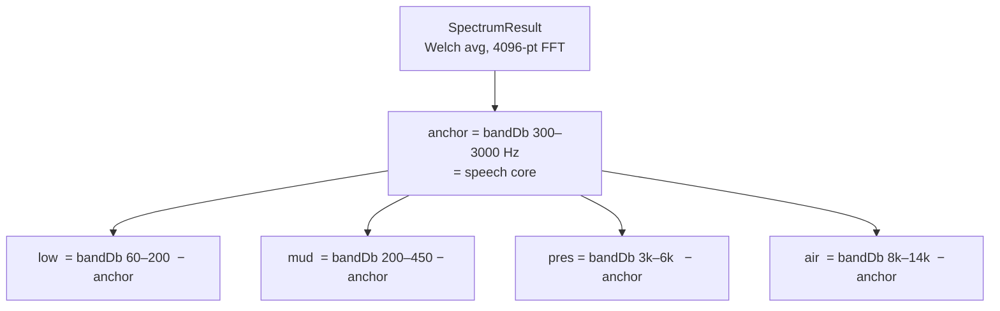

Four band balances are measured *relative to the speech core* (300–3000 Hz). Each
is compared against a fixed **target balance** for clean speech:

| Band | Region | Target (dB rel. anchor) | EQ shape |
|---|---|---|---|
| low | 60–200 | −2 | low shelf @ 200 |
| mud | 200–450 | −1 | peak @ 320, Q 0.9 |
| presence | 3000–6000 | −3 | peak @ 4000, Q 0.9 |
| air | 8000–14000 | −10 | high shelf @ 8000 |

### 4.2 Per-band decision — single-spectrum path

`computeAutoEqBands` (used before denoise completes, dry spectrum only):

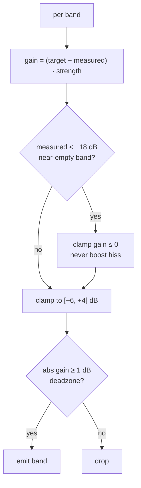

Cuts up to 6 dB (controlling excess is safe), boosts limited to 4 dB
(conservative), deadzone 1 dB, wide shelves/bells only — no surgical notches.

### 4.3 Per-band decision — noise-aware path

When both the dry spectrum and the denoised voice profile exist
(`computeNoiseAwareAutoEqBands`), **intent comes from the denoised voice** (so
rumble/noise doesn't bias the target) but **boost magnitude is constrained by the
dry spectrum**, because the user may lower Noise Reduction and re-expose
background.

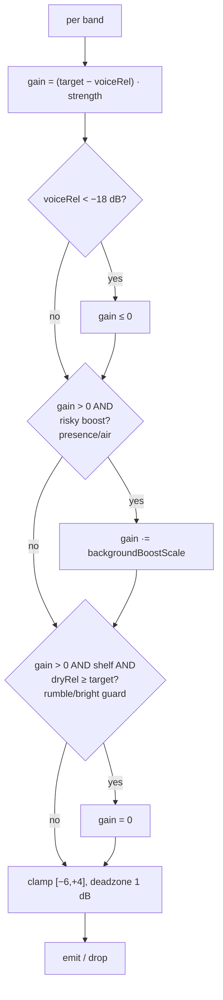

`backgroundBoostScale` (applied to presence @4k and air @8k boosts):

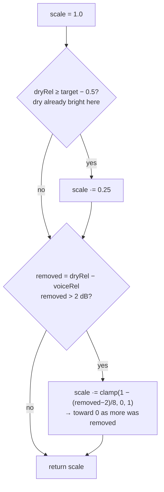

Band wiring (`riskyBoost` flag in the last column):

| Band | freq | type | risky boost? |
|---|---|---|---|
| low | 200 | low shelf | no (shelf rumble guard instead) |
| mud | 320 | peak | no |
| presence | 4000 | peak | **yes** |
| air | 8000 | high shelf | **yes** |

### 4.4 Worked example — the harsh-high-frequency failure this prevents

A speaker with little natural high-frequency content, recorded with audible HF
background (hiss, AC, harsh phone playback). Denoise strips the background, so the
**denoised voice profile looks dull** up top. A naive curve from that profile
alone adds a presence/air boost to "restore" brightness. Then the user lowers
Noise Reduction (e.g. to 40–50 % to keep the voice natural) — the dry background,
which also lived in those high bands, blends back in, now amplified. Harsh.

The noise-aware path stops this: intent still says "this band is low," but
`backgroundBoostScale` checks the dry profile first. Dry already bright there →
boost scaled to 25 %; denoise removed a lot there → scaled toward zero. The boost
survives only when the brightness is genuinely missing from *both* voice and
background. The symmetric low-shelf guard does the same downward: a thin denoised
voice won't trigger a low boost if the dry low end is already heavy (rumble).

Locked in by [`tests/DspBehaviorTests.cpp`](../tests/DspBehaviorTests.cpp): the
same dull denoised voice gets a presence boost > 1 dB with a *clean* dry signal,
but < 1 dB with a *harsh* dry signal.

### 4.5 Tone (independent user character)

`toneAmountBands(amount)` layers a manual character on top of auto-EQ
(−1 warm … +1 crisp): warm = low-shelf body boost + high-shelf soften; crisp =
mud trim + air boost. `fullEqBands()` concatenates auto-EQ then tone.

### 4.6 Strength

`strength` (0..1) scales the whole corrective curve, set from Intensity via
`applyIntensity`: `baseAutoEqStrength = 0.25 + 0.35 · intensity`. Default
load-time strength is 0.6.

---

## 5. Noise reduction (blend) and the denoiser

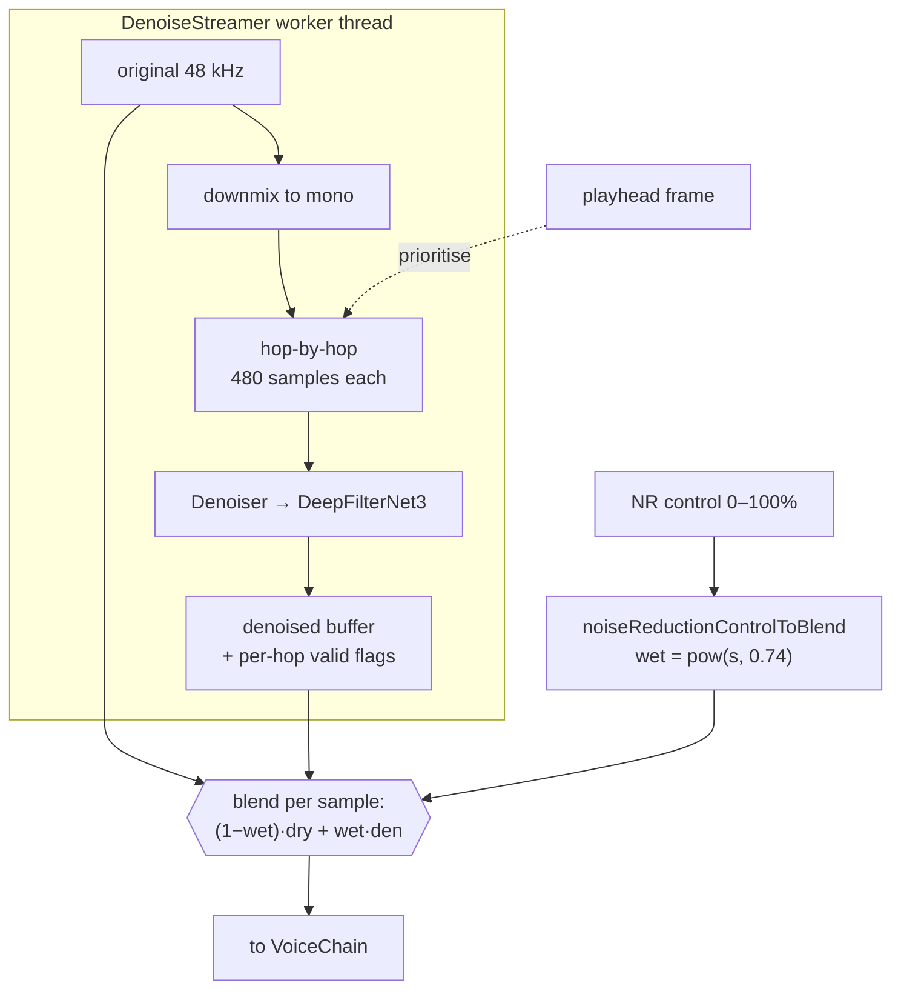

- The control percentage is bent through `noiseReductionControlToBlend(s) =
  s^0.74` so the dial reaches the useful range earlier; endpoints preserved.
- **This amount is currently 100 % user-chosen** — nothing measures the signal to
  set it. That's the gap the planned auto-dial fills (§8).
- The streamer ([`DenoiseStreamer.cpp`](../core/DenoiseStreamer.cpp)) prioritises
  the playhead region, backfills the rest, compensates the model's 3-hop
  look-ahead so denoised stays sample-aligned with dry (no comb filtering on
  partial blends), and primes ~20 discarded warmup hops after a seek.
- DeepFilterNet3 runs at 48 kHz mono, 480-sample hops, near-unlimited attenuation
  (`attenLimDb = 100`).

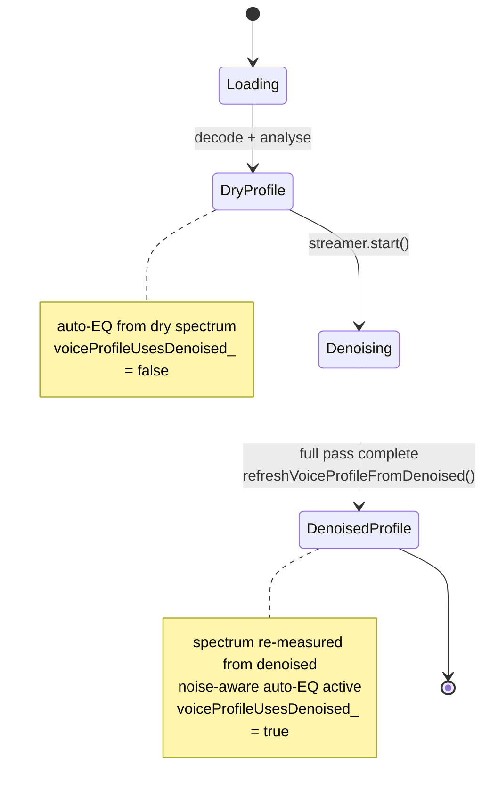

---

## 6. Parameter derivation (UI controls → ChainParams)

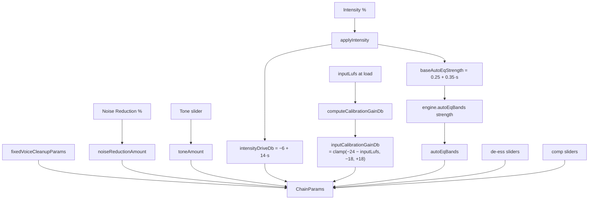

`buildParams()` in [`MainComponent.cpp`](../desktop-juce/MainComponent.cpp)
starts from `fixedVoiceCleanupParams()` and overlays the live control values.

- **Calibration**: the file is trimmed toward `targetPreChainLufs = −24 LUFS`
  (clamped ±18 dB) so the fixed-threshold compressors behave consistently
  regardless of how hot the source was.
- **Intensity** adds drive (−6…+8 dB) *and* raises auto-EQ strength.
- **Auto-EQ bands** are recomputed at the current strength and injected; the
  engine picks the noise-aware vs single-spectrum function based on
  `voiceProfileUsesDenoised_`.
- Presets (`Light/Balanced/Strong`) preset highpass, comp threshold/ratio,
  target LUFS, and de-esser aggressiveness.

---

## 7. Offline vs live chain

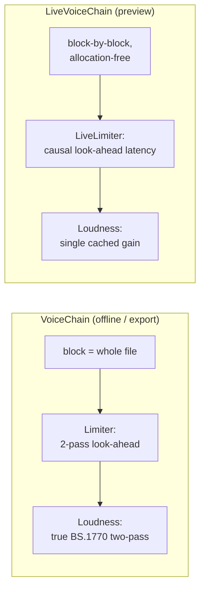

Same stage order, deliberate differences
([`LiveVoiceChain.h`](../core/LiveVoiceChain.h)):

| Aspect | Offline `VoiceChain` | Live `LiveVoiceChain` |
|---|---|---|
| Granularity | whole buffer | per audio block, no allocation |
| Loudness | exact two-pass measure → gain | single gain from cached input LUFS + target |
| Limiter | offline two-pass | causal `LiveLimiter` (adds latency) |
| Params | passed to `prepare` | pushed lock-light from message thread |
| Used by | `process()`, `exportTo()` | `PreviewPlayer` audio callback |

The live loudness uses `measureChainLoudness()` (an offline pass on a copy) to
estimate the level arriving at the loudness stage, so the cached live gain still
hits the target despite compression. Export always uses the offline chain for an
exact render.

---

## 8. Backing music and ducking

```mermaid
flowchart LR
    CLIPS["music clips<br/>gain + fades + offset"] --> REND["render mix"]
    VOICE["processed voice"] -->|"sidechain key"| DUCK
    REND --> DUCK["Ducker"]
    DUCK --> SUM{"{+ voice"}}
    SUM --> OUTM["preview output"]
```

`Ducker` ([`Ducker.h`](../core/Ducker.h)) is a sidechain ducker: the voice keys
the music down. A look-ahead delay on the music lets the duck start just before
the voice transient. `blend` morphs full-band ducking (0) → mid-band-only
(250 Hz–4 kHz) ducking (1), so at blend 1 the music's lows and highs pass through
(dynamic-EQ-style duck):

```
out = m − (1 − g) · ( m·(1 − blend) + mid·blend )
```

> **Divergence to note:** ducking currently lives in the **live preview**
> (`PreviewPlayer` + `Ducker`). The offline `ProcessingEngine::mixMusicInto` adds
> music with gain + fades only — it does **not** duck. Export music is therefore
> not sidechain-ducked today.

---

## 9. Analysis caching

`loadMedia` caches everything reusable so a reopened file is instantly "prepared"
without re-running the model:

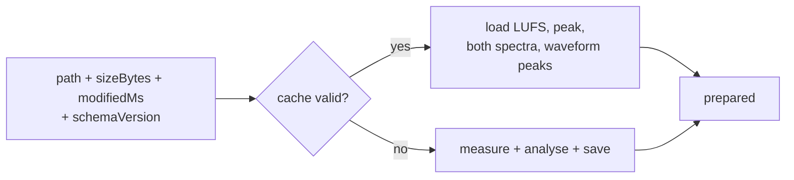

Schema-versioned JSON keyed by path + size + mtime
([`ProcessingEngine.cpp`](../desktop-juce/ProcessingEngine.cpp),
`kAnalysisCacheVersion`). Stores derived analysis only — never heavy denoised or
processed audio buffers. Invalidated on identity, mtime, or schema change.

---

## 10. Planned feature — automatic noise-reduction dial-in

Goal: instead of the user picking a noise-reduction %, **measure the separation
between voice and background and choose the amount automatically** — more
reduction when the background is loud, less (≈40–50 %) when the voice is already
clearly intelligible and only needs cleanup.

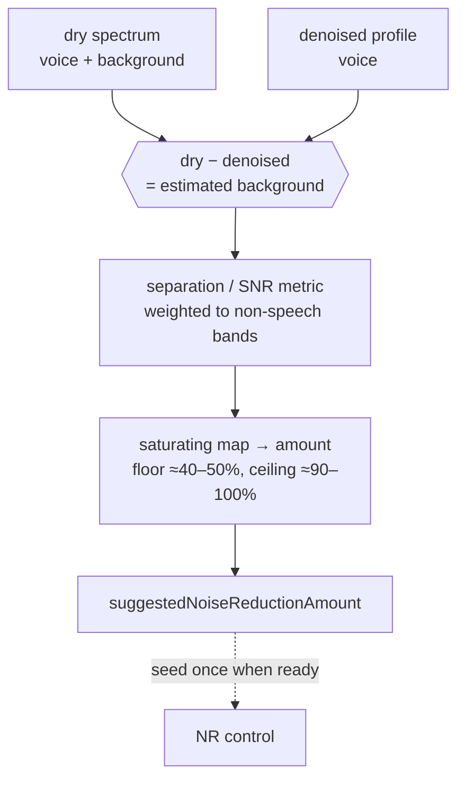

This is a sibling of `computeNoiseAwareAutoEqBands` — same dry-vs-denoised
comparison. Everything needed already exists and is cached:

| Signal | Source | Meaning |
|---|---|---|
| `drySpectrum()` | original | voice + background |
| `spectrum()` (denoised) | model output | voice |
| `inputLufs()`, `inputPeakDb()` | load measurement | overall dry level |
| `previewSpectrum(amount)` | power blend | what a chosen amount looks like |

**Design constraints / fit:**

- Keep the metric→amount mapping a pure function in `vc_core` next to
  `noiseReductionControlToBlend`; add a behavior test.
- A reliable estimate needs the *full* denoised profile (after
  `refreshVoiceProfileFromDenoised`). Offer a provisional value from the dry
  spectrum at load, refine when denoised — mirroring how auto-EQ upgrades.
- The encoder is the source of truth (`buildParams` reads the slider), so the
  cleanest first version **seeds the slider once** when analysis completes rather
  than continuously driving it.
- If derived purely from cached spectra it needs no extra persistence; storing
  the suggestion in the analysis cache (bump `kAnalysisCacheVersion`) keeps it
  stable across reopens.

**Open questions:** broadband vs band-weighted metric? floor/ceiling amounts and
curve shape? auto-apply vs suggest-and-seed? (Music is mixed after the chain, so
it shouldn't bias the voice spectra — confirm.)
